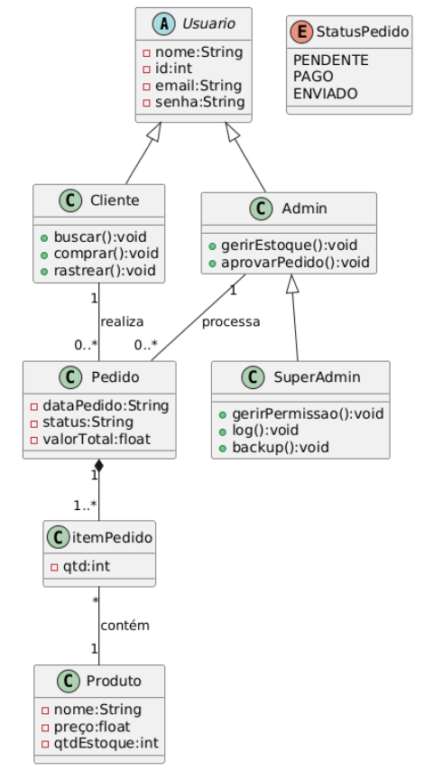

# Levantamento de Requisitos para um E-commerce

## Requisitos Funcionais:
### Para o Usuário
1. Gestão de Usuários
2. Catálogo de Produtos
3. Carrinho de Compras
4. Checkout
5. Rastreamento
### Para o Administrador
1. Gestão de Inventário
2. Gestão de Pedidos
3. Relatórios e Dashboards
4. Gestão de Promoção
### Para o Super Administrador
1. Gestão de Permissões
2. Configurações do Sistema
3. Logs de Auditoria
4. Monitoramento de Erro e Logs
5. Gestão de Backups
6. Modo de Manutenção
7. Limpeza de Cache
8. Gerenciamento de Webhooks

## Requisitos Não Funcionais:
1. Tempo de Resposta
2. Escalabilidade
3. Uptime
4. Criptografia
5. Conformidade (LGPD)
6. Segurança de Pagamento
7. Mobile-First
8. Acessibilidade
9. SEO

## UML
